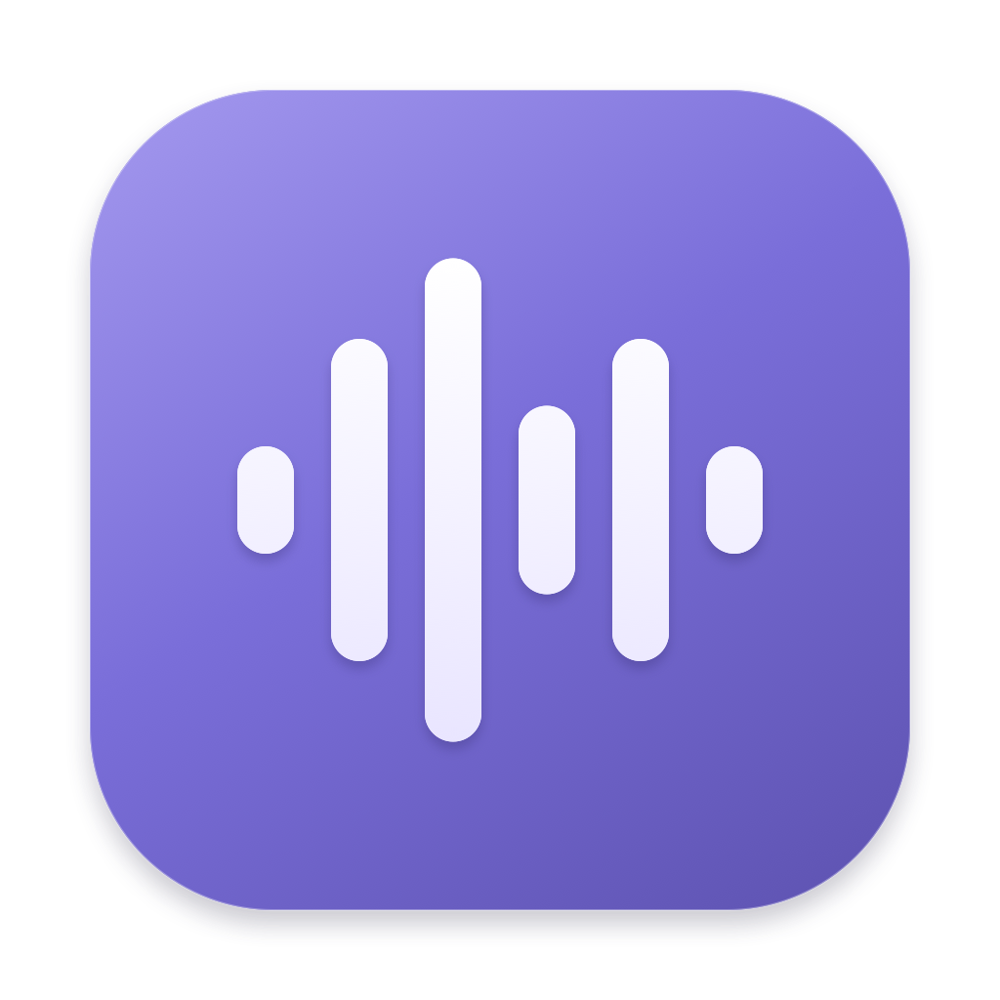

<h1 align="center">Scriber</h1>

<strong>简体中文</strong> · <a href="README.en.md">English</a>

<strong>录下来，接着用。</strong> Mac 菜单栏里的录音与录屏工具，让重要内容变成本地文件。

<a href="https://github.com/luyao618/scriber/releases/download/v0.1.1/Scriber-0.1.1-macOS-arm64.dmg"><strong>下载 Mac 版</strong></a> · <a href="docs/USAGE.md">使用说明</a> · <a href="https://raw.githubusercontent.com/luyao618/dayscribe/main/video/scriber-intro-en.mp4">一分钟演示（MP4）</a> · <a href="docs/ACCEPTANCE.md">验收记录</a>

↑ 10 秒操作预览 · <a href="https://raw.githubusercontent.com/luyao618/dayscribe/main/video/scriber-intro-en.mp4">下载完整 60 秒 MP4</a> 1080p · 英文配音与画面说明 · 中英双语字幕 · 原生界面实拍

## 为什么用 Scriber

会议里的一段讨论，通话中的一个决定，视频中的一段讲解。你想留下当下听到、看到的内容，之后回听、分享，或者交给自己的 Agent 整理。

Scriber 把录制放进一个随时能打开的小面板：选择声音和范围，点开始，结束后拿到自己的文件。

- **声音分开控制。** 电脑声音、麦克风分别开关，实时电平和状态让你看清每一路是否收到声音。
- **录屏自带独立音频。** 一次录制，同时保存带声音的 MP4 和同名 M4A，省去事后提取音轨。
- **文件直接留在本机。** 保存目录自己选，在历史里播放、改名或定位，然后交给习惯的工具继续使用。

Scriber 专注录制与文件管理。总结、转录和分析由你选择的其他工具完成。

## 怎么使用

1. **呼出面板。** 点击菜单栏的波形图标，或按默认快捷键 **⌥R**。
2. **选择要录的内容。** 录音时确认电脑声音和麦克风；录屏时再选择区域、窗口或整块屏幕。
3. **开始记录。** 随时查看时长与收音状态，也可以直接修改文件名。收起面板后，录制继续。
4. **停止并保存。** 文件自动存入选定目录，在历史中播放，或通过 Finder 打开。

| 选择 | 得到的文件 |
|---|---|
| 录音 | 一个 M4A，混合录制时开启的声音来源 |
| 录屏 | 一个带声音的 MP4 + 一个同名独立 M4A |

录屏支持 **自选区域、单个窗口、整块屏幕**。框选区域后按回车开始，Esc 取消。录音与录屏的目录可以分别设置，录屏的两份文件会保存在一起。

## 开始使用

需要 **Apple Silicon Mac（M1 或更新芯片）与 macOS 26+**。

1. **[下载 Scriber DMG](https://github.com/luyao618/scriber/releases/download/v0.1.1/Scriber-0.1.1-macOS-arm64.dmg)。** 也可在 [Release 页面](https://github.com/luyao618/scriber/releases/tag/v0.1.1)选择 ZIP。
2. 打开 DMG，将 **Scriber.app** 拖进 **Applications（应用程序）**。
3. 打开 Scriber，点击菜单栏波形图标，或按 **⌥R** 开始使用。

无需编译，也无需安装 Xcode。当前是**未经过 Apple 公证的预览版**；首次打开若被 macOS 拦截，请前往 **系统设置 → 隐私与安全性 → 仍要打开**，为 Scriber 确认放行。

首次录制按提示授予「屏幕与系统音频录制」和「麦克风」权限。当前仅录麦克风时也需要屏幕与系统音频录制权限。

界面支持简体中文和英文：系统首选英文时显示英文，其余默认中文。也可通过 macOS 单应用语言设置切换，重启生效。

默认保存在 `~/Movies/Scriber/录音` 与 `~/Movies/Scriber/录屏`。点击面板中的目录行即可更改。应用运行不依赖 Python、FFmpeg 或云服务。

完整的权限、快捷键、改名和恢复操作见 [使用说明](docs/USAGE.md)。

## 当前状态

v0.1 的录制面板、双路声音、三种录屏范围、配对文件、历史管理与异常恢复已经交付。

真实 **8 小时录音**与 **2 小时录屏**已有文件时长、完整解码及资源记录。八小时录音保留了麦克风切换后的恢复警告，不能据此认定全程声音无缺口。耳机物理切换、麦克风连续性，以及锁屏／睡眠／合盖由项目所有者后续自行验收，发现问题再提 bug。详细结果和范围见 [验收概览](docs/ACCEPTANCE.md)。

## 文档与开发

- [使用说明](docs/USAGE.md)：权限、录音、录屏、目录与历史。
- [开发与验证入口](docs/DEVELOPMENT.md)：从源码构建（需要 Xcode 26）、签名、真实采集检查及实现行为。
- [发布预编译应用](docs/RELEASING.md)：DMG／ZIP 打包、校验与发布流程。
- [需求与边界](SPEC.md) · [详细验证记录](docs/VALIDATION.md)。
- [产品短片与制作源文件](video/README.md)：分镜、字幕、素材来源、本地播放器与重新生成方法。
- [面板设计](design/DESIGN.md) · [交互原型](design/index.html)：已确认的视觉基线；原型使用演示数据。
- [Goal 与小 PR 交付约定](GOAL.md)。

仓库早期的 dayscribe 方向已[归档](docs/archive/dayscribe/IDEAS.md)，旧 ASR 实验保留在 [PR #4](https://github.com/luyao618/dayscribe/pull/4)，不属于当前 Scriber 的功能范围。
