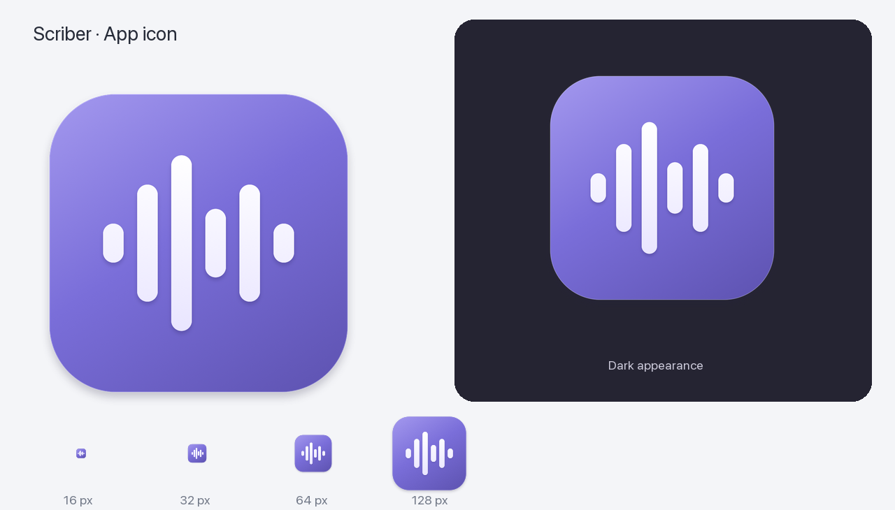

# Scriber macOS application icon

The app icon carries the existing six-bar waveform from `docs/media/scriber-mark.svg` onto an iris tile. A white waveform stays legible against the purple background, while subtle edge lighting and shadows fit macOS application surfaces. There is no permanent recording-status badge or text to misread at small sizes.

- Face: iris `#7067CF`, with light `#A398EE` and shaded `#6055B4` surfaces.
- Mark: white to `#E9E5FF`; the asymmetric waveform proportions retain the existing brand silhouette.
- Geometry: 1024-square canvas, transparent margin, rounded tile and six rounded bars.
- Small sizes: slightly wider, pixel-aligned bars at 16/32 pixels; shadow distances scale in device pixels so they do not become clipped gray boxes.



`scripts/render-app-icon.swift` is the editable vector drawing source and only needs the macOS SDK. The checked-in `App/Resources/AppIcon.icns` contains the ten standard 16–1024 pixel representations. `Scriber-1024.png` is the full-resolution preview. The app's `CFBundleIconFile` references this resource, and the existing build script copies it before signing. This does not replace the monochrome menu-bar symbol or change recording behavior.

To regenerate from the repository root:

```sh
swift scripts/render-app-icon.swift artifacts/app-icon/rendered
cp artifacts/app-icon/rendered/AppIcon.icns App/Resources/AppIcon.icns
cp artifacts/app-icon/rendered/Scriber-1024.png design/icon/Scriber-1024.png
```

The preview sheet uses the same image on light and dark surfaces, not separate runtime icon variants.

The renderer uses Apple's `iconutil` to encode the standard iconset. Validate the container with `iconutil --convert iconset`. Its legacy 16/32px RGB/mask round trip can change partially transparent edge colors; verify dimensions, alpha and opaque colors and inspect the icon resolved by `NSWorkspace`, rather than requiring identical exported bytes.
